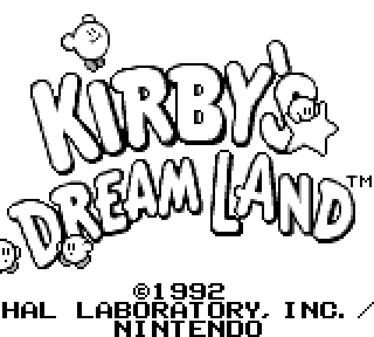

# nth-boy

A work in progress Gameboy emulator written in Rust

  
  
  
  
  

## Progress

- [x] CPU
- [x] GPU
- [x] MBC
  - [x] MBC1
  - [x] MBC2
  - [x] MBC3
  - [x] MBC5
 - [ ] Audio
 - [ ] GBC support
 
## Try it

Try the [WASM port](https://f-biondi.github.io/nth-boy/) of the emulator directly from your browser
